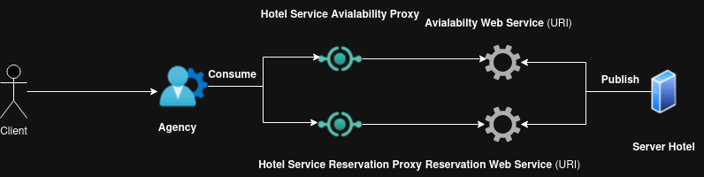

# TP 2 Archi_Dis
# SOAP Web Services

## Description
In This Project we implemeted a hotel reservation system for  hotels and it can be applied for each number of hotels.

This Project is TP2 of UE HAI704I in the university of Montpellier.

The Client can use web methods and make reservations.

Communication between different stack is done using SOAP Technologie

### Breif Idea

This implementation is based on:
 
A. __ServerSide__

1. **Each Hotel has his own server.**
2. **The server publish 2 web services on diffrent URI.** 
3. **Server 1 is used to check the avialabilty of offers.**
4. **Server 2 enable the agency and client to make a reservation.**

B. __ClientSide__

1. **Each user becomes a client when he login to an agency.**
2. **The agency can consume the web service after using a proxy.**
3. **The client can check avialable offers and make a reservation.**

### Prerequisites
List any dependencies or tools the user needs to have installed before running the project.
Example:
- Java 1.8 (Ability of using wsimport command)
- Maven
- SpringBot 2.7.18
- Jax-WS (Java API for Web Services)
- Spring-WS

###### MANSOUR Malik M1 GL Montpellier 07/11/2024 